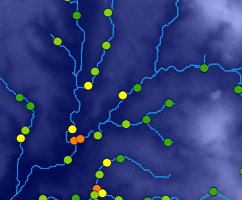
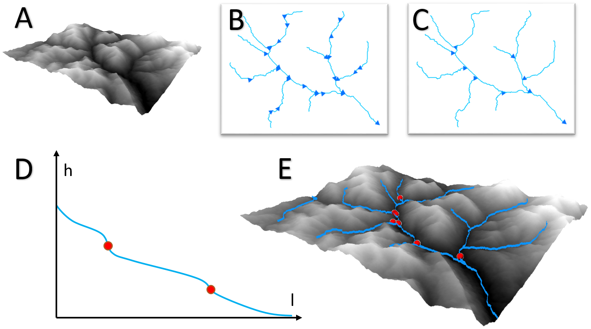

# KnickpointFinder 
***A software tool that improves neotectonic analysis***

***`v1.1`***

Software for extensive and dense knickpoint (stream-slope anomaly) mapping in a fully-automatic manner. It performs morphometric analysis of drainage networks based on the methods of Hack (1973) and Etchebehere (2004) and is applicable to studies of geomorphology and neotectonics. The input is a digital elevation model (DEM), used to identify topographic breakpoints (knickpoints) along drainage profiles. This tool is coded in Python (v2.7) for use in ArcMap (v10.x).

**Authors**: [`Gustavo Lopes Queiroz`](http://guslq.com/), `Eduardo Salamuni`, `Edenilson Roberto do Nascimento`

[**`Original publication (Queiroz et al., 2015)`**](https://doi.org/10.1016/j.cageo.2014.11.004)

**Figure**: Example output knickpoints and watershed polylines overlaying the input DEM. Point color scheme reflects anomaly severity from low (cool colors) to high (warm colors).

## Setup
To run the tool, the user must first extract all the contents of the compressed folder and then open ESRI's ArcMap (v10.x). Then, the user must find and open the KnickpointFinder.tbx toolbox in ArcCatalog and then run the KnickpointFinder script tool.

## Inputs
* **Digital elevation model (DEM)**: a raster DEM projected in a UTM coordinate system (eg. 30m SRTM DEM).
* **Watershed-scale**: the scale in which the watershed will be analyzed (eg. 1:100,000).
* **Δh threshold**: the minimum height difference used to measure stream segments (eg. 10m).

## Outputs
* **Knickpoints**: a shapefile containing points over the stream-slope anomalies. Each point has the following attributes:
 * **Stream gradient index of segment (SL)**: Based on Hack (1973).
 * **Total slope-extent relationship of drainage (SER)**: Based on Etchebehere (2004).
 * **Anomaly order (1st or 2nd)**: Based on Seeber & Gornitz (1983).
 * **SL/SER**: Useful for mapping and analysis.
* **3D hierarchical drainage network**: optional output.

## How it works

**Figure**: Overview of the main steps in the KnickpointFinder algorithm: (A) input digital elevation model (DEM) raster; (B) watershed generated by a series of ArcGIS spatial analyst tools; (C) cleaned and fixed drainage lines with segments merged from source to mouth; (D) a slope/length formula is applied on the drainage profile - illustrated as a graph of height (h) versus length (l) - to identify anomalies; and (E) output knickpoints over a 3D drainage network.

## References
* Etchebehere, M. L., Saad, A. R., Fulfaro, V. J., & de Jesus Perinotto, J. A. (2004). Aplicação do Índice" Relação Declividade-Extensão-RDE" na Bacia do Rio do Peixe (SP) para detecção de deformações neotectônicas. *Geologia USP. Série Científica, 4*(2), 43-56.
* Hack, J. T. (1973). Stream-profile analysis and stream-gradient index. *Journal of Research of the us Geological Survey, 1*(4), 421-429.
* Queiroz, G. L., Salamuni, E., & Nascimento, E. R. (2015). Knickpoint finder: A software tool that improves neotectonic analysis. *Computers & Geosciences, 76*, 80-87.
* Seeber, L., & Gornitz, V. (1983). River profiles along the Himalayan arc as indicators of active tectonics. *Tectonophysics, 92*(4), 335-367.

